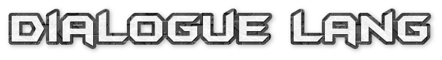

# Dialogue Lang



Dialogue Lang is a robust and flexible dialogue system designed for use in Unity-based game development. It offers a unique syntax and structure for creating dynamic, interactive dialogues in games.

## Features

- **Conditional Dialogue Flow**: Easily control dialogue paths using conditions based on game states.
- **Dynamic Variable Handling**: Incorporate game variables directly into your dialogues.
- **Multi-Section Dialogue**: Define complex dialogues with multiple sections and choices.

## Getting Started

To get started with Dialogue Lang, clone this repository and import it into your Unity project.

```bash
git clone https://github.com/Conor-McDonagh-Rollo/Dialogue-Lang.git
```

## Prerequisites
- Unity 2022.3.13f1 or later
- Basic understanding of Unity

## Installation
- Clone the repository.
- Import the package into your Unity project.
- Follow the supplied documentation to integrate Dialogue Lang into your game.

## Example Dialogue Script
DialogueTest.txt
```txt
MyVariable = 0

[initial]
Hello, this is the start of the dialogue
you can updates the dialogue variable here
to reveal the next dialogue option when we
talk again.

Update Variable [INVOKE]
if [MyVariable == 1] Continue [section2]
Exit [EXIT]

[section2]
And that's how conditions streamline this 
whole process!

Thanks! [EXIT]
```

## Generating the Docs
- Download [Doxygen](https://www.doxygen.nl/download.html)
- Open a terminal in the root of the repository
- Type `doxygen Doxyfile` and it should generate it